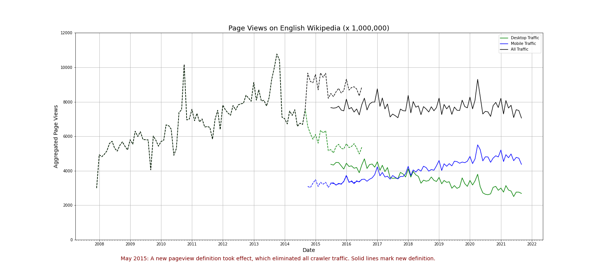

# A1 - Data Curation

[![Contributors][contributors-shield]][contributors-url]
[![MIT License][license-shield]][license-url]
[![LinkedIn][linkedin-shield]][linkedin-url]

## About The Project

The goal of this assignment is to construct, analyze, and publish a dataset of monthly traffic on English Wikipedia from January 1 2008 through August 30 2021. For this assignment, we combine data about Wikipedia page traffic from two different Wikimedia REST API endpoints into a single dataset, perform some simple data processing steps on the data, and then analyze that data, by creating a simple visualization. 

The purpose of the assignment is to demonstrate that we can follow best practices for open scientific research in designing and implementing your project, and make the project fully reproducible by others: from data collection to data analysis. As a result, the following [Notebook](https://github.com/sharma-apoorv/data-512-a1/blob/main/src/A1_Data_Curation.ipynb) was created to demonstrate the best practices being followed.

The following is the structure of the directory and files present:
```
.
├── README.md
├── requirements.txt
├── data
    ├── raw
        ├── pagecounts_desktop-site_200712-201608.json
        ├── pagecounts_mobile-site_200712-201608.json
        ├── pageviews_desktop_201507-202110.json
        ├── pageviews_mobile-app_201507-202110.json
        └── pageviews_mobile-web_201507-202110.json
│   ├── processed
        ├── en-wikipedia_traffic_200712-202109.csv
│   └── visualizations
        ├── en-wikipedia_traffic_200712-202109.png
└── src
│    └── A1_Data_Curation.ipynb

```

## API Documentation

To collect the data we used 2 different API's:

1. [Pageview API](https://wikimedia.org/api/rest_v1/#/Pageviews%20data/get_metrics_pageviews_aggregate__project___access___agent___granularity___start___end_)
    * Given a date range, this API returns a timeseries of pageview counts. You can filter by project, access method and/or agent type. You can choose between daily and hourly granularity as well.
    * Data available from December 2007 through July 2016
2. [Legacy (Pagecount) API](https://wikimedia.org/api/rest_v1/#/Legacy%20data/get_metrics_legacy_pagecounts_aggregate__project___access_site___granularity___start___end_)
    * Given a project and a date range this API returns a timeseries of pagecounts. You can filter by access site (mobile or desktop) and you can choose between monthly, daily and hourly granularity as well.
    * Data available from  July 2015 through present

## Dataset

Once the data was collected, the data was cleaned and transformed into a more consumable format. This data was stored as a [CSV](https://github.com/sharma-apoorv/data-512-a1/blob/main/data/processed/en-wikipedia_traffic_200712-202109.csv) file. The following table describes the columns in the file:

| Column Name             | Description                                     |
|-------------------------|-------------------------------------------------|
| year                    | The year in which the data was collected (YYYY) |
| month                   | The month in which the data was collected (MM)  |
| pagecount_all_views     | Number of page views from all clients acquired from the Legacy Pagecounts API |
| pagecount_desktop_views | Number of page views from desktop clients acquired from the Legacy Pagecounts API |
| pagecount_mobile_views  | Number of page page views from mobile clients acquired from the Legacy Pagecounts API |
| pageview_all_views      | Number of page views from all clients acquired from the Pageviews API |
| pageview_desktop_views  | Number of page views from desktop clients acquired from the Pageviews API |
| pageview_mobile_views   | Number of page views from mobile clients acquired from the Pageviews API |

## Results

The following chart was generated after collecting and processing the data:



## Important notes
* As much as possible, we're interested in organic (user) traffic, as opposed to traffic by web crawlers or spiders. The Pageview API (but not the Pagecount API) allows you to filter by agent=user. Thus, we filter by `user` in the Pageview API.
* There was about 1 year of overlapping traffic data between the two APIs. We gather and graph data from both the API's, including the overlapping period

## Dependencies

[Anaconda](https://www.anaconda.com/) was used to maintain and install project dependencies. Additionally, a [requirements.txt](https://github.com/sharma-apoorv/data-512-a1/blob/main/requirements.txt) file has been provided to install all dependencies used in the notebook. 

## Usage

The repo can be cloned using the following command:
```
git clone https://github.com/sharma-apoorv/data-512-a1.git
```

The dependencies can be installed into an environment using the following command:
```
conda create --name <envname> --file requirements.txt
```

The environment is activated as follows:
```
conda activate <envname>
```

Lastly, the jupyter notebook kernel can be started using the following command:
```
jupyter-notebook
```

Executing the above command will open a link in the browser. Navigate to the notebook and click on "Run All" in the notebook to execute the commands.

## License

Distributed under the MIT License. See `LICENSE.md` for more information.

[Wikimedia Foundation REST API - License agreements](https://www.mediawiki.org/wiki/REST_API#Terms_and_conditions)

<p align="right">(<a href="#top">back to top</a>)</p>

<!-- MARKDOWN LINKS & IMAGES -->
<!-- https://www.markdownguide.org/basic-syntax/#reference-style-links -->
[contributors-shield]: https://img.shields.io/github/contributors/sharma-apoorv/data-512-a1.svg?style=for-the-badge
[contributors-url]: https://github.com/sharma-apoorv/data-512-a1/graphs/contributors
[license-shield]: https://img.shields.io/github/license/sharma-apoorv/data-512-a1.svg?style=for-the-badge
[license-url]: https://github.com/sharma-apoorv/data-512-a1/blob/main/LICENSE.md
[linkedin-shield]: https://img.shields.io/badge/-LinkedIn-black.svg?style=for-the-badge&logo=linkedin&colorB=555
[linkedin-url]: https://linkedin.com/in/sharmavapoorv/